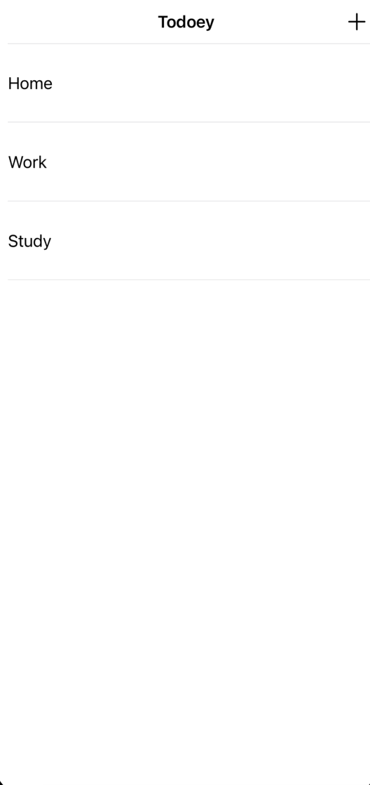
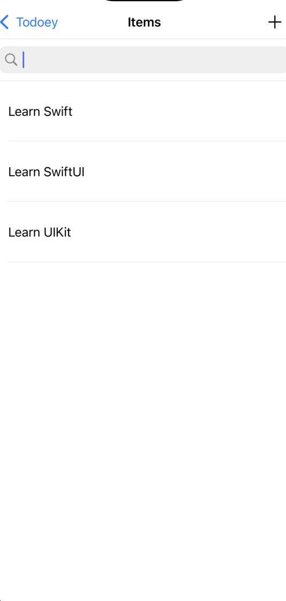
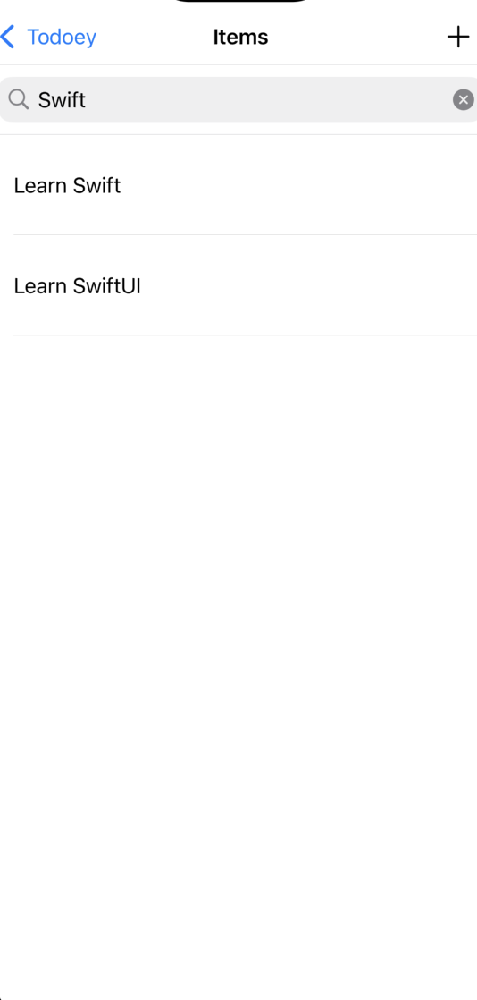

# Todoey

### A simple iOS/iPadOS todo app

## Used technologies and tools

- Swift
- UIKit
- MVC design pattern
- UITableView
- Realm
- SwipeCellKit

*This project was developed as part of The Complete iOS App Development Bootcamp by London App Brewery*

*Minimum supported OS version is 13.0*

## Illustrations

### Main screen:

### Category screen:

### Search in category screen:

